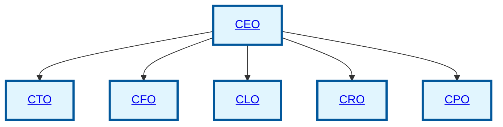

# Executive Leadership Organization Chart

This chart illustrates the structural hierarchy within the Executive Leadership team, detailing reporting lines and functional responsibilities.

## Department Structure Overview

The **Executive Leadership** team is structured to provide strategic direction and operational oversight for the company. Each executive leader reports directly to the CEO and has distinct functional areas of responsibility:

1.  **CTO (Chief Technology Officer)**: Oversees technology strategy, innovation, and engineering excellence.
2.  **CFO (Chief Financial Officer)**: Manages financial strategy, accounting, and capital allocation.
3.  **CLO (Chief Legal Officer)**: Provides legal guidance and ensures regulatory compliance.
4.  **CRO (Chief Revenue Officer)**: Leads revenue generation, sales, and go-to-market strategies.
5.  **CPO (Chief Product Officer)**: Defines product vision and manages the product lifecycle.

Each executive leads their respective functions and collaborates closely with other C-level executives to align strategic initiatives with business objectives.